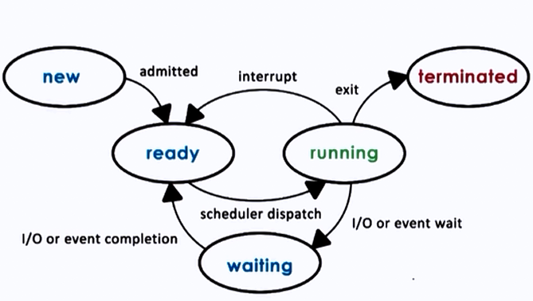

VID-1 => video link "https://youtu.be/WJ-UaAaumNA?si=LeCwZkUsZHB8DEnB"

What  OS - definition(Abstracted Form)?
=>Operating System vaneko euta system software ho jun chai
 hardware ra user ko bich ma interaction garauna help garxa

Why OS?
=> if user le kaile hardware access garna paryo vane
each individual device ko lagi program lekhnu parxa 
Tesle garda User ra hardware ko bich ma difficult banauxa
ra Memory heavy banauxa ra multi user garna mildaina.

The Primary goal of OS :-
-> To provide Convenience
-> Throughput :- jati number of tasks executed per unit time 

Hamilai esto OS chaiyo jasko Throughput ni dherai hos ra Convenience ni hos
((Throughput ko lagi chai LINUX use hunxa Tei vayera mostly server haru ma use hunxa ))

Functionality of OS:

-> Resource Management
(hardware or software lai manage garxa in (/Parallel processing\))

Eg: (Jastai dui jana le euta printer ekai choti access garna khojdai xaan re 
Ani printer ko vitra ko OS le decide garxa ki kasle suruma print garne vanera ki ta 
server access ma ni use hunxa kasle suru ma server access garne vanera efficiently manage garxa)

-> Process Management(CPU scheduling)

Process or Application lai manage garxa kasari execute garne vanera vanxa
Definition of Process : Process is an instance of a program in execution.
Eg: (Jastai MS word , chrome , media player kholda kholesi yo sabai process lai kasari execute garne .
    vanera jasari kunai program lai execute garnu paryo vane tyo program process banxa )

