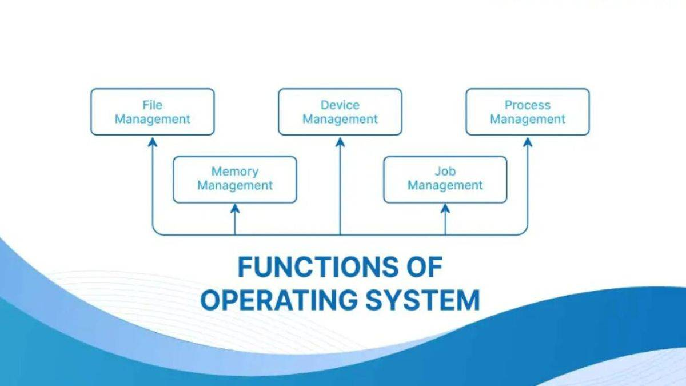

VID-1 => video link "https://youtu.be/WJ-UaAaumNA?si=LeCwZkUsZHB8DEnB"

What  OS - definition(Abstracted Form)?
=>Operating System vaneko euta system software ho jun chai
 hardware ra user ko bich ma interaction garauna help garxa

Why OS?
=> if user le kaile hardware access garna paryo vane
each individual device ko lagi program lekhnu parxa 
Tesle garda User ra hardware ko bich ma difficult banauxa
ra Memory heavy banauxa ra multi user garna mildaina.

The Primary goal of OS :-
-> To provide Convenience
-> Throughput :- jati number of tasks executed per unit time 

Hamilai esto OS chaiyo jasko Throughput ni dherai hos ra Convenience ni hos
((Throughput ko lagi chai LINUX use hunxa Tei vayera mostly server haru ma use hunxa ))

Functionality of OS:

-> Resource Management
(hardware or software lai manage garxa in (/Parallel processing\))

Eg: (Jastai dui jana le euta printer ekai choti access garna khojdai xaan re 
Ani printer ko vitra ko OS le decide garxa ki kasle suruma print garne vanera ki ta 
server access ma ni use hunxa kasle suru ma server access garne vanera efficiently manage garxa)

-> Process Management(CPU scheduling)

Process or Application lai manage garxa kasari execute garne vanera vanxa
Definition of Process : Process is an instance of a program in execution.
Eg: (Jastai MS word , chrome , media player kholda kholesi yo sabai process lai kasari execute garne vanera jasari kunai program lai execute garnu paryo vane tyo program process banxa )

-> Storage Management

Storage Management ma secondary device aauxa jastai SSD (Solid State Drive)
or Harddisk File system use garera manage garxa .
 
Jati ni data aaudai xa teslai permanently kasari store garne vanne kura describe garxa.

-> Memory Management 

Operating System (OS) ko ekdam important kaam ho memory manage garnu. Computer ma RAM limited huncha, tesaile OS le smart way ma RAM ko use manage garcha.

🔑 Main Kaam haru of OS in Memory Management:
In Points:-
1. Allocation and Deallocation
2. Keeping Track of Memory
3. Virtual Memory
4. Memory Protection
5. Swapping / Paging

Further Explanation:-

1. Allocation and Deallocation
Jab kunai program run huncha, OS le uslai memory allocate garcha.
Jab program sakkincha ya close huncha, OS le tyo memory free garcha so aru program use garna sakos.

2. Keeping Track of Memory
OS le sabai memory ko map banayera rakhcha (kaha free cha, kaha used cha).
Kun program le kati memory use gareko cha bhanne kura OS le track garcha.

3. Virtual Memory
Yo ek trick ho jasma OS le hard disk lai RAM jasto use garcha.
Jaba RAM ma thau hudaina, OS le disk ma data rakhera RAM free banaucha.
Yo le dherai programs ekai choti run garna madat garcha.

4. Memory Protection
Kunai program le aru program ko memory access na garos bhanera OS le protection garcha.
Euta program le arko ko data corrupt garna paydaina.

5. Swapping / Paging
OS le programs lai parts ma divide garcha (pages).
Tyo parts lai RAM ra disk bich swap garda, large programs pani RAM ma run garna sakcha.

